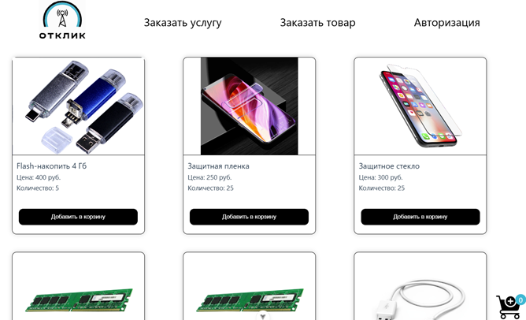
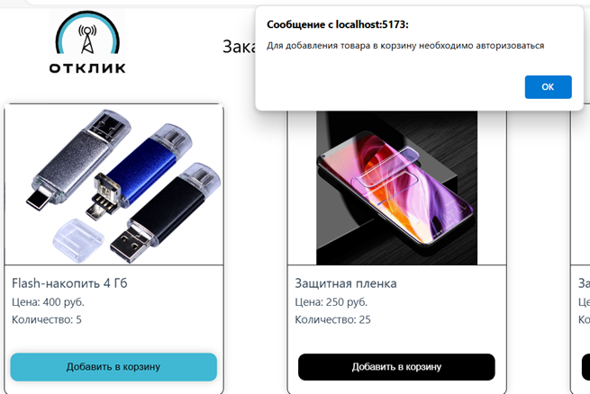
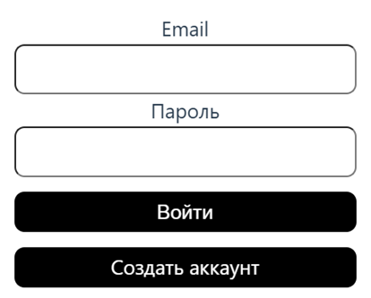
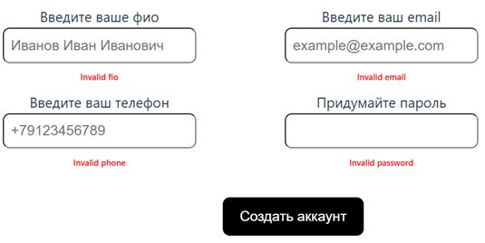
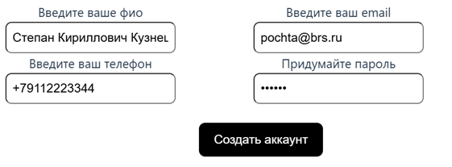
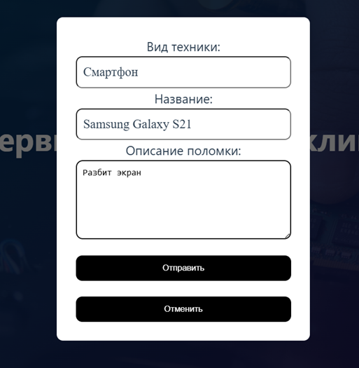
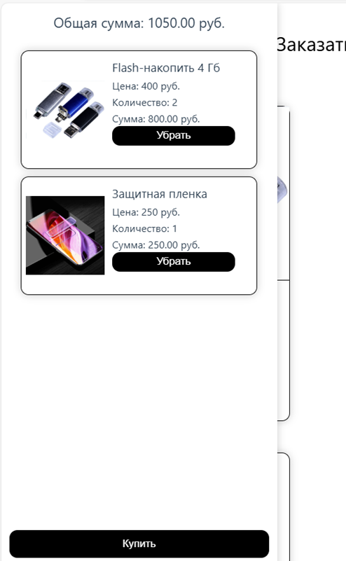
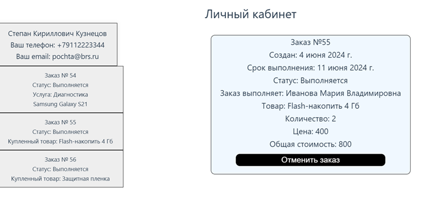

# ServiceCenter
сайт сервисного центра-магазина с применением трехзвенной архитектуры.
### Выполненные задачи:
  - создание структуры базы данных;
  - реализация ORM (Entity Framework) на платформе ASP.NET;
  - создание и интеграция логики работы с пользователями, заказами и товарами;
  - создание интерфейса для пользователей сервисного центра и магазина, с возможностью обработки данных в реальном времени;
  - реализация Swagger для автоматической генерации документации API и упрощения тестирования эндпоинтов.

Стек технологий:
```C#, PostrgeSQL, Entity Framework, VueJS, Swagger, REST API```


#### Загрузка товаров из бд


#### Требование авторизоваться перед заказом


#### Меню авторизации


#### Валидация данных при регистрации





#### Авторизация


#### Заказ на ремонт


#### Покупка


#### Личный кабинет

